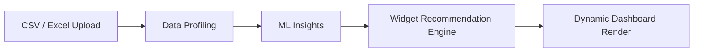

# ML Destekli Dinamik Dashboard

## Akış



## Backend Endpointleri

- `GET /api/data-profile`: kolon tipi, null oranı, benzersiz değer, min/max/ortalama ve top değerler.
- `GET /api/ml/insights`: forecast, anomaly ve segment çıktılarını standart model zarfıyla döndürür.
- `GET /api/dashboard/dynamic`: profil + ML çıktılarını skorlayıp en uygun 6-8 widget listesini verir.

## ML Service

`ml-service` içinde `POST /analyze` gerçek scikit-learn modelleri çalıştırır:

- Feature engineering: `SimpleImputer`, `StandardScaler`, `OneHotEncoder`
- Forecast/regression: `LinearRegression.fit()`, MAE, RMSE, R2
- Anomaly: `IsolationForest.fit_predict()`
- Segmentation: `KMeans.fit_predict()`

Örnek çıktı:

```json
{
  "dataset_type": "tabular",
  "target_column": "revenue",
  "forecast": {
    "type": "forecast",
    "confidence": 0.85,
    "model": "sklearn LinearRegression + preprocessing pipeline",
    "metrics": { "mae": 12.3, "rmse": 18.9, "r2": 0.82 },
    "data": [{ "row": "T+1", "predicted": 240.5 }]
  },
  "anomalies": {
    "type": "anomaly",
    "confidence": 0.82,
    "model": "sklearn IsolationForest",
    "data": [{ "row": 4, "score": 0.71 }]
  },
  "segments": {
    "type": "segment",
    "confidence": 0.78,
    "model": "sklearn KMeans",
    "data": [{ "segment": 0, "count": 12 }]
  }
}
```

## Widget Skorlama

Widget motoru profil ve ML sonucuna göre skor üretir:

- Forecast widget: model confidence yeterliyse öne çıkar.
- Anomaly widget: anomali varsa yüksek skor alır.
- Segment widget: en az iki anlamlı segment varsa gösterilir.
- Trend, KPI, Top-N ve Profil widgetları veri yeterliyse tamamlayıcı olarak sıralanır.

Veri yetersizse dashboard `"Veri arttıkça burada içgörüler görünecek"` empty state mesajını gösterir.
